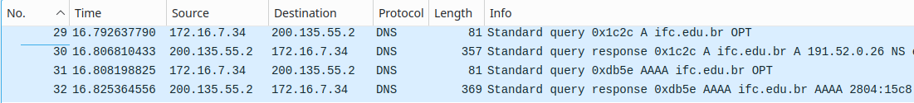

# DNS

Nesta atividade, vamos usar o wireshark para olhar os pacotes que utilizam o protocolo de transporte UDP. Mais detalhes sobre o funcionamento do UDP ou até mesmo material adicional para entender melhor os assuntos tratados nesta atividade estão no capítulo 14.3.

## Como gerar pacotes UDP

O foco vai ser analisar pacotes UDP, e para gerar pacotes UDP vamos utilizar o comando `nslookup`. Este comando funciona da seguinte maneira: invoca o protocolo DNS (Domain Name Server) que por sua vez irá um datagrama UDP

```bash
nslookup <endereco>
```

Ex: `nslookup ifc.edu.br` irá resultar em algo como isso:

```bash
Server:         127.0.0.53
Address:        127.0.0.53#53

Non-authoritative answer:
Name:   ifc.edu.br
Address: 191.52.0.26
Name:   ifc.edu.br
Address: 2804:15c8::26
```

Ele mostra a resolução do endereço nos seus respectivos endereços, tanto IPv4 quanto IPv6

## Wireshark

Iniciando o Wireshark, selecione a sua interface de rede, caso esteja usando o wifi ele irá filtrar pelos pacotes passando pela rede wifi inteira, portanto se você utilizar este filtro *(ip.src == seuIP || ip.dst == seuIP)* e substituir a palavra "seuIP" pelo seu ip da interface wifi então é possível filtrar apenas os pacotes que sejam seus ou que tenham sido endereçados a você. Para filtrar pacotes UDP é necessário apenas usar o filtro *udp*, por exemplo o que eu usarei para demonstrar ficou assim: *udp && (ip.src == 172.31.6.122 || ip.dst == 172.31.6.122)*.

Após aplicar o filtro inicie a captura de pacotes e execute o comando nslookup em um endereço que você não tenha acessado desde a última inicialização, pois caso já tenha acessado ele ficara armazenado em um cache local para que não seja necessário usar o protocolo DNS toda vez que for acessar este endereço, logo após pare a captura de pacotes, no wireshark você terá algo parecido com isto:



Pode ser que haja mais pacotes, pois nesse meio tempo pode ter havido outras conexões UDP, porém você consegue identificar os pacotes que o nslookup gerou visualizando o campo *info* e você pode identificar que o endereço utilizado no comando está ali.

## Perguntas
Aqui estão algumas perguntas para serem respondidas sobre a análise de pacotes, responda individualmente para si

1. Selecione o primeiro segmento UDP na sua captura.
    1. Qual é o número do pacote desse segmento no arquivo de captura?


    2. Que tipo de carga de aplicação ou mensagem de protocolo está sendo transportada nesse segmento UDP?


    3. Quantos campos existem no cabeçalho UDP?


    4. Quais são os nomes desses campos?


2. Consultando as informações exibidas no campo de conteúdo do pacote no Wireshark, qual é o comprimento (em bytes) de cada um dos campos do cabeçalho, UDP?


3. O valor no campo comprimento (Length) refere-se ao comprimento de quê? Verifique sua afirmação com o pacote UDP capturado.


4. Qual é o número máximo de bytes que podem ser incluídos em uma carga útil UDP?


5. Qual é o maior número de porta de origem possível?


6. Qual é o número do protocolo UDP? Dê sua resposta em notação decimal.


7. Examine o par de pacotes UDP em que seu host envia o primeiro pacote UDP e o segundo pacote UDP é uma resposta a esse primeiro pacote UDP. (Dica: para que um segundo pacote seja enviado em resposta ao primeiro pacote, o remetente do primeiro pacote deve ser o destino do segundo pacote).
    1. Qual é o número do pacote do primeiro desses dois segmentos UDP no arquivo de captura?


    2. Qual é o valor no campo da porta de origem neste segmento UDP?


    3. Qual é o valor no campo da porta de destino neste segmento UDP?


    4. Qual é o número do pacote do segundo desses dois segmentos UDP no arquivo de captura?


    5. Qual é o valor no campo da porta de origem neste segundo segmento UDP?


    6. Qual é o valor no campo da porta de destino neste segundo segmento UDP?


    7. Descreva a relação entre os números de porta nos dois pacotes.
