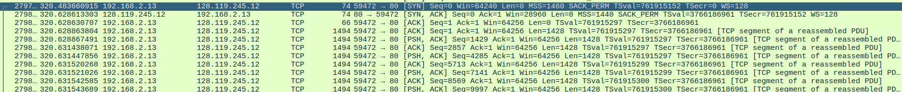

# Capturando uma transferência TCP em massa do seu computador para um servidor remoto

## Preparação

### Download do arquivo.
- Inicie seu navegador web.
- Abra a pagina a seguir <https://gaia.cs.umass.edu/wireshark-labs/alice.txt>.
- Salve a pagina como um arquivo __.txt__.
    - Na opção __Salvar a pagina como...__.
    - O nome padrão é ___alice.txt___.

### Captura de pacotes.
- Inicie o wireshark.
- Inicie a captura na sua porta com acesso a internet.
- defina o filtro `http && ip.dst == 128.119.245.12`.
- aplique o filtro.
    - Flecha no canto direito do campo de filtro.

### Envio do pacote.
- Pelo navegador acesse o site <https://gaia.cs.umass.edu/wireshark-labs/TCP-wireshark-file1.html>.
- Va ao botão __Browse...__ e selecione o arquivo, __alice.txt__ que voce baixou previamente.
- Envie o arquivo apertando no botão __Upload alice.txt file__.
- Verifique se um pacote pacote apareceu no wireshark.
    - sera algo proximo disso:

        `number	time	192.168.x.x	128.119.245.12	HTTP	156	POST /wireshark-labs/lab3-1-reply.htm HTTP/1.1  (text/plain)`

### Analise do pacote HTTP.
- click no pacote HTTP POST.
- Vamos primeira mente analizar os segmentos TCP.
    - Apos clicar no arquivo aparecera varios campos. Expanda o campo com o nome proximo de:

        `[111 Reassembled TCP Segments (152886 bytes): #279881(1428), #279882(1428), ...`
- Podemos analizar que nesse exemplo de nome, ja temos a informacão que foram 111 segmentos TCP.

### Analizando pacotes TCP
- Precisamos mudar o filtro do wireshark para encontrar esses pacotes.
- Mude o filtro para `tcp && ip.dst == 128.119.245.12 || ip.src == 128.119.245.12`.
- Agora vamos encontrar os segmentos referentes ao arquivo no meio de todos esse outros pacotes.

    - O primeiro segmento é um __[SYN]__ para o servidor
    - O segundo segmento é a resposta do servidor __[SYN, ACK]__
    - O terceiro pacote __[ACK]__ é a confirmacao do cliente para completar o ___three-way handshake___
    - O quarto pacote ja inicia o processo de envio do arquivo. Carrega a mensagem POST e o início do arquivo alice.txt. O campo __len__ mostra quantos bytes foram mandados.
- Todos os segmentos referentes a imagens estarão antes do protocolo HTTP que analizamos anteriormente.

## Atividade

### Perguntas Gerais.
Agora que voce encontrou todos os pacotes responda.

1. Qual é o endereço IP e o número da porta TCP usado pelo computador cliente(origem) que está transferindo o arquivo alice.txt para <https://gaia.cs.umass.edu/>?

2. Qual é o endereço IP de <https://gaia.cs.umass.edu/> e em qual porta enviando e recebendo segmentos TCP para esta conexão?

### Perguntas sobre TCP.

3. Qual é o número de sequência do segmento TCP SYN que é usado para iniciar a conexão TCP entre o computador cliente e <https://gaia.cs.umass.edu/>?

4. Qual é o número de sequência do segmento SYNACK enviado por <https://gaia.cs.umass.edu/> para o computador cliente em resposta ao SYN? O que identifica este segmento como um segmento SYNACK? Qual é o valor do campo de reconhecimento no segmento SYNACK? Como <https://gaia.cs.umass.edu/> determinou esse valor?

5. Qual é o número de sequência do segmento TCP que contém o cabeçalho do comando HTTP POST?

6. Considere o segmento TCP contendo o HTTP "POST" como o primeiro segmento na parte de transferência de dados da conexão TCP.
    1. Em que momento o primeiro segmento (aquele que contém o HTTP POST) na parte de transferência de dados da conexão TCP foi enviado?
    2. Em que momento o ACK para este primeiro segmento contendo dados foi recebido?
    3. Qual é o RTT (tempo de ida e volta) para este primeiro segmento contendo dados?
    4. Qual é o valor do RTT para o segundo segmento TCP contendo dados e seu ACK
    5. Qual é o valor estimado do RTT após o recebimento do ACK para o segundo segmento contendo dados?

<!--TODO TSval vem em qual unidade  -->

7. Qual é o comprimento (cabeçalho mais carga útil) de cada um dos quatro primeiros segmentos TCP contendo dados?

8. Qual é a quantidade mínima de espaço de buffer disponível anunciada ao cliente por <https://gaia.cs.umass.edu/> entre esses quatro primeiros segmentos TCP contendo dados? A falta de espaço de buffer do receptor alguma vez restringiu o remetente para esses quatro primeiros segmentos contendo dados?

9. Há algum segmento retransmitido no arquivo de rastreamento? O que você verificou (no rastreamento) para responder a essa pergunta?

10. Quanto de dados o receptor tipicamente reconhece em um ACK entre os dez primeiros segmentos contendo dados enviados do cliente para <https://gaia.cs.umass.edu/>? Você consegue identificar casos em que o receptor está reconhecendo a cada dois segmentos recebidos (veja a Tabela 3.2 no livro) entre esses dez primeiros segmentos contendo dados?

9. Qual é a taxa de transferência (bytes transferidos por unidade de tempo) para a conexão TCP? Explique como você calculou esse valor.
