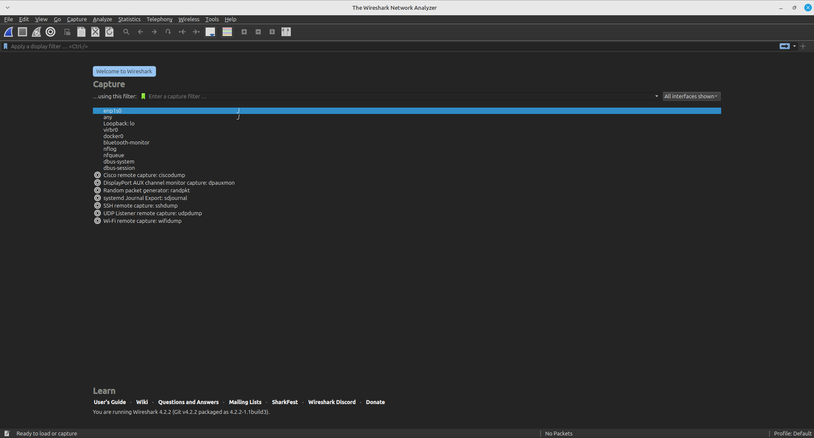
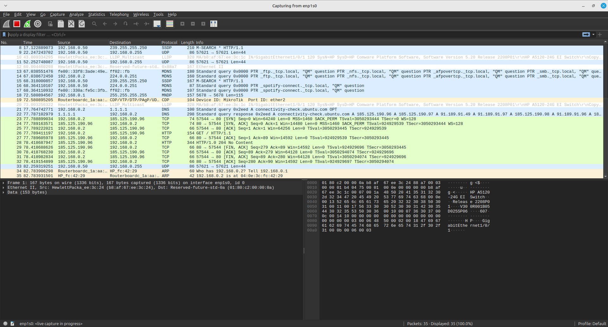
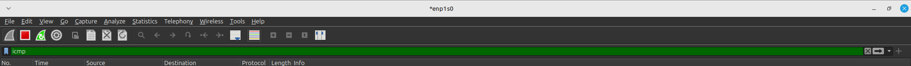
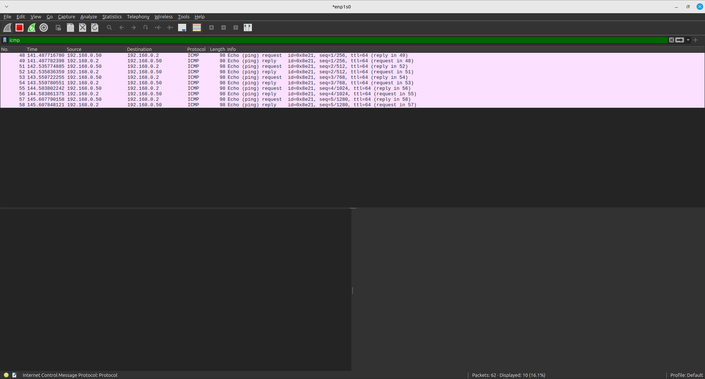
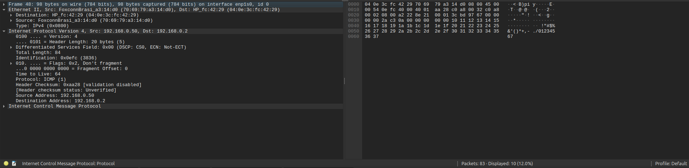

# Prática captura de pacotes

O foco dessa prática é capturar pacotes que passam pela sua NIC (Network Interface Card / Placa de rede), para isso será mostrado dois métodos, um utilizando uma GUI (Graphic User Interface / Interface Gráfica de Usuário) e outra usando CLI (Command Line Interface / Interface de Linha de Comando). Com o objetivo final de capturar pacotes ICMP\
Utilizando GUI será utilizado o software wireshark \
Utilizando CLI será utilizado o comando tcpdump \

## Wireshark

Wireshark é um analisador de rede que pode capturar e exibir detalhes em tempo real do tráfego de rede. \

### Instalação

Site para download <https://www.wireshark.org/download.html> \
_Para linux as informações estão no final da página na sessão 'Third-Party Packages'_

### Como capturar pacotes

Para capturar os pacotes é necessário abrir o wireshark, selecionar a interface que deseja ser monitorada e então aplicar os filtros necessários para o tipo de pacote que é desejado, vamos destrinchar tudo isso:

### Como selecionar a interface

É necessário selecionar a interface de rede para capturar os pacotes dela, no caso dessa atividade utilizaremos a interface de ethernet, nos computadores do ifc no laboratório em que está sendo realizado o curso ela se chama enp1s0, em computadores pessoais ela pode ter um nome diferente, no windows por exemplo é chamada de ethernet

Para selecionar a interface basta apenas clicar duas vezes nela e obterá uma tela parecida com esta:


### Como filtrar por pacotes ICMP

Para filtrar pacotes ICMP é necessário inserir "icmp" no campo "Apply a display filter" que fica na parte superior


#### Porque pacotes ICMP?

Foram escolhidos porque é o protocolo utilizado pelo comando "ping", para testar experimente abrir um terminal apertando super/win e digitando "terminal", e utilizar o comando ping para o endereço que foi colocado como Gateway padrão, geralmente é 192.168.x.1 sendo o x variável de acordo com a rede que você está. Ao realizar o comando ping enquanto está capturando pacotes você verá algo parecido com esta tela


### Visualizar pacotes

Podemos ainda selecionar pacotes e visualizar-los com melhor exatidão, ao clicar em um pacote na parte de baixo você verá algo parecido com isso:


## tcpdump

Para utilizar o comando tcpdump é necessário utiliza-lo em um terminal, aperte super/win e pesquise "terminal", para utiliza-lo utilize o comando:

```bash
tcpdump
```

Este deve ter retornado um erro, para utilizar o tcpdump é necessário rodar como administrador, para isso é necessário apenas colocar a palavra "sudo" antes do comando tcpdump, então ao rodar ele deve funcionar e já filtrar por uma interface padrão

## Como escolho a interface filtrada?

```bash
sudo tcpdump -i enp1s0
```

O -i do comando indica que a próxima palavra escrita será a interface que deseja filtrar

## Como consigo filtrar pacotes ICMP?

```bash
sudo tcpdump 'icmp' -i enp1s0
```

Após chamar o comando com tcpdump é colocado entre aspas simples (') o que deseja ser filtrado, as aspas não são obrigatórias porém para filtros mais complexos elas são portanto isto pode ser visto como uma boa prática utilizar aspas simples

## Como posso descobrir mais?

Para ver um guia rápido de ajuda digite:

```bash
tcpdump -h
```

Para ter um melhor entendimento leia o manual, disponivel ao digitar:

```bash
man tcpdump
```

## Porque usar tcpdump ao inves de wireshark?

Pois quando realizar conexões remotas ou quando estiver trabalhando com um servidor que não tem uma interface visual de usuário então será apenas por linha de comando e com isso o wireshark não funcionaria mas o tcpdump sim
