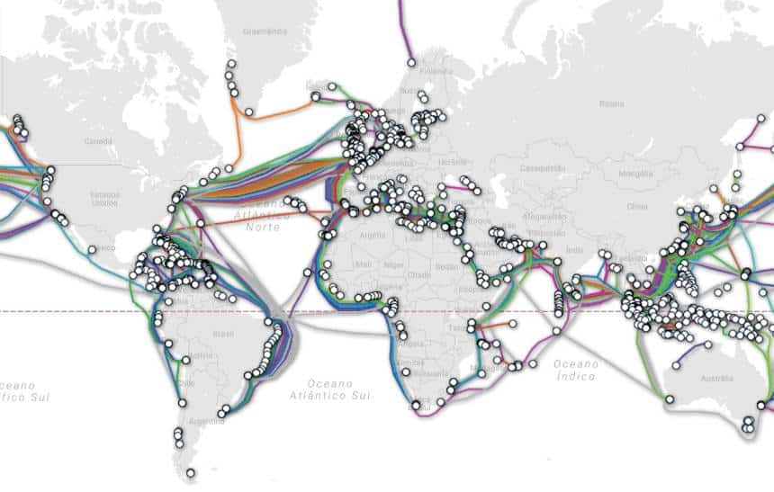
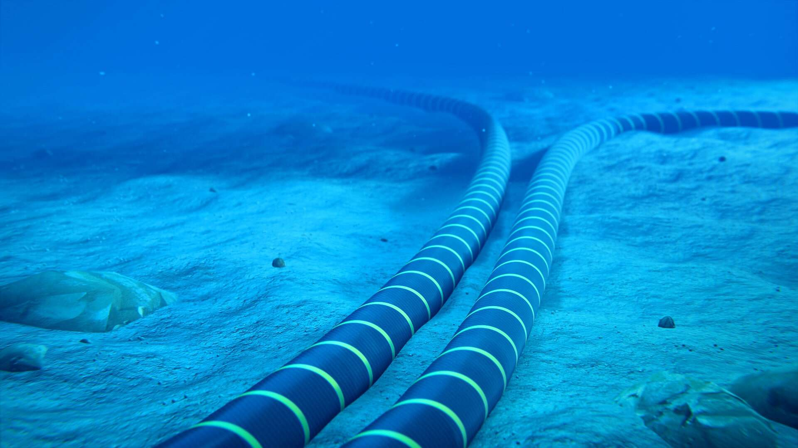

# Fibra Óptica

## Cabeamento

### Conector
- [Vídeo](https://www.youtube.com/watch?v=QXyzL8X0x7Y);

### Solda
- [Vídeo 1](https://www.youtube.com/watch?v=53Xvs0VDiXQ);
- [Vídeo 2](https://www.youtube.com/watch?v=ot3Lag7LCqY);

## Cabos Submarinos

-  Mapa de todos os cabos submarinos
    
    *Fonte: [Submarine Cable Map](https://www.submarinecablemap.com)*

- Cabo submarino de fibra óptica que liga Brasil à Portugal
    
- [Tubarão comendo cabo](https://www.youtube.com/watch?v=OoIuKIx3drs);
- [Instalação de cabos submarinos](https://www.youtube.com/watch?v=d0gs497KApU);
- [Consertando cabos submarinos](https://www.youtube.com/watch?v=l1knCR6xAzo).