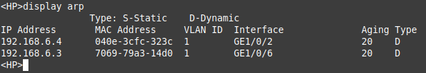
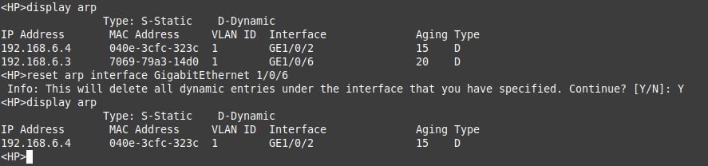
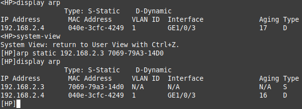

# Prática tabela ARP no switch
Esta tarefa utiliza um switch Layer 3 disponível no laboratório. Para realizar esta prática você precisa estar conectado ao equipamento e saber o IP do seu equipamento.

## Linux

Este roteiro se baseia em comandos disponíveis em um sistema Linux mint 22 e em um switch HP A5120.

### Como conectar-se ao switch

Verifique em qual rede você está conectado, e então determine o IP do switch. \
Por padrão os switch's no laboratório tem o IP como: 192.168.X.2 \
Sendo que o X é variável. \

#### Telnet

Após determinar o IP do switch então você usara o comando telnet em um terminal, exemplo caso o IP do meu switch seja 192.168.6.2 então o comando ficara:

```bash
telnet 192.168.6.2
```

Então uma conexão será estabelecida, será requisitado o nome de usuário e uma senha que são: \
Username: admin \
Password: local_admin 

Após a autenticação ser concluída com sucesso você terá acesso ao console do switch

### Visualização

Para realizar a visualização da tabela arp utiliza-se o seguinte comando:

```bash
display arp
```

Isto mostrará a tabela arp, será algo parecido com está:


### Como deletar uma entrada

No switch é possível deletar entradas de várias formas porém aqui vamos mostrar como deletar usando a interface GigabitEthernet como referêncial. \
Para isso é necessário utilizar o comando:

```bash
reset arp interface GigabitEthernet x/y/z
```

onde os números x, y e z são variaveis, caso queira saber exatamente qual interface a entrada ARP que você quer deletar é possível identificar isto usando o comando "display arp" na coluna "Interface". \
Aqui vai um exemplo onde quero deletar a entrada da porta 6:


### Como inserir uma entrada

Para inserir deve-se estar no modo de visualização do sistema, para isso digite:

```bash
system-view
```

E então para inserir utilize o seguinte comando:

```bash
arp static {ip} {MAC address}
```

Sendo que o MAC deve seguir um padrão, por exemplo o MAC como você veria seria assim: \
01:23:45:67:89:ab \

E o comando pede para que ele siga outro formato o H-H-H, traduzindo o endereço MAC acima ficaria assim: \
0123-4567-89ab \

Aqui vai um exemplo de como ocorrerá o procedimento de inserir uma nova entrada:

